<div align="center">

# LABORATORIO #2 — CLASES EN C#

### Programación Orientada a Objetos · C# · .NET · Consola

<br>

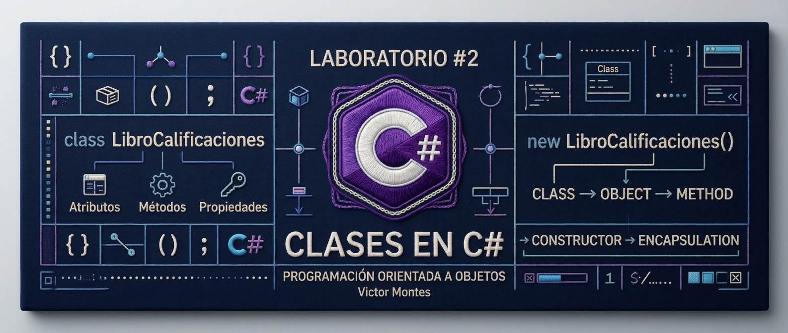

<br><br>

**Autor:** Victor Montes
**Universidad Tecnológica de Panamá — UTP**
**Facultad de Ingeniería de Sistemas Computacionales — FISC**

<br>


<br>

**Fecha:** 15/09/2026

</div>

---

## 1. Información del Laboratorio

| Campo                      | Información                       |
| -------------------------- | --------------------------------- |
| **Laboratorio**            | #2                                |
| **Tema**                   | Clases en C#                      |
| **Lenguaje**               | C#                                |
| **Framework / Plataforma** | .NET                              |
| **IDE**                    | Visual Studio                     |
| **Tipo de aplicaciones**   | Consola                           |
| **Paradigma**              | Programación Orientada a Objetos  |
| **Autor**                  | Victor Montes                     |
| **Universidad**            | Universidad Tecnológica de Panamá |
| **Fecha**                  | 15/09/2026                        |

---

# 2. Contenido del Repositorio

Este laboratorio contiene tres actividades prácticas desarrolladas en **C#**, enfocadas en comprender progresivamente el funcionamiento de las **clases, objetos, métodos, constructores, propiedades y encapsulamiento**.

### Evolución del laboratorio

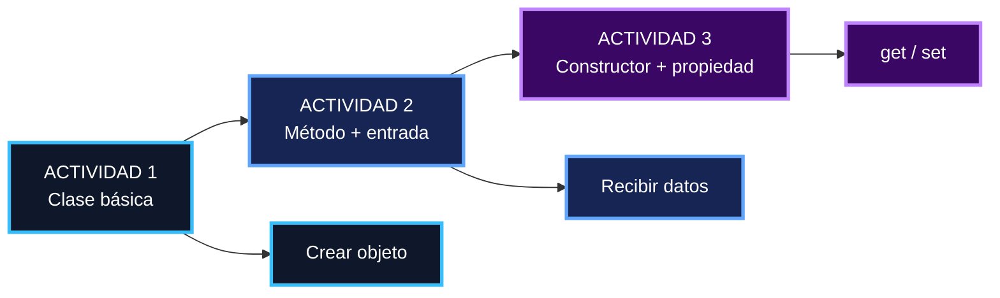

### Conceptos principales

<div align="center">

<table>
<tr>
<td align="center">


**C#**

</td>
<td align="center">


**.NET**

</td>
<td align="center">


**Visual Studio**

</td>
<td align="center">

**CLASS**

Clase

</td>
<td align="center">

**OBJECT**

Objeto

</td>
<td align="center">

**METHOD**

Método

</td>
<td align="center">

**GET / SET**

Propiedad

</td>
</tr>
</table>

</div>

---

# 3. Tecnologías Utilizadas

<div align="center">

<table>
<tr>

<td align="center" width="150">

<a href="https://learn.microsoft.com/en-us/dotnet/csharp/">

</a>

<br>

**C#**

</td>

<td align="center" width="150">

<a href="https://dotnet.microsoft.com/">

</a>

<br>

**.NET**

</td>

<td align="center" width="150">

<a href="https://visualstudio.microsoft.com/">

</a>

<br>

**Visual Studio**

</td>

<td align="center" width="150">

<a href="https://git-scm.com/">

</a>

<br>

**Git**

</td>

<td align="center" width="150">

<a href="https://github.com/">

</a>

<br>

**GitHub**

</td>

</tr>
</table>

</div>

### Herramientas

* **C#** — Lenguaje utilizado para desarrollar las actividades.
* **.NET** — Plataforma utilizada para ejecutar las aplicaciones.
* **Visual Studio** — Entorno de desarrollo utilizado para programar y ejecutar los proyectos.
* **Git** — Sistema de control de versiones.
* **GitHub** — Plataforma utilizada para almacenar y documentar el laboratorio.

---

# 4. Estructura Conceptual

El laboratorio presenta una evolución desde una clase sencilla hasta una clase que utiliza **constructor y propiedades encapsuladas**.

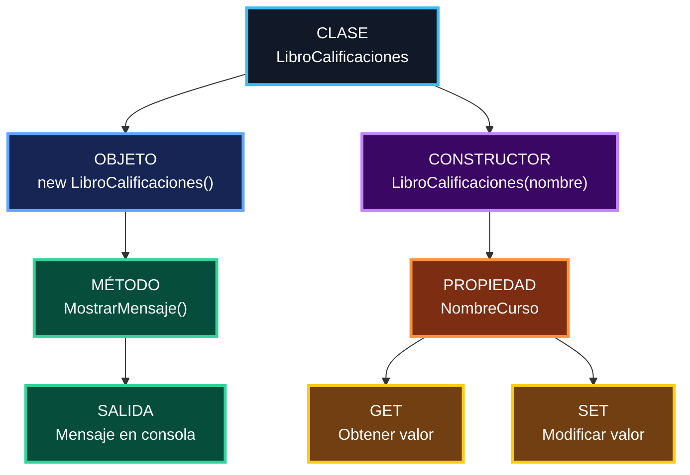

---

# 5. Actividad 1 — Clase Básica

## Objetivo

Crear una clase sencilla en C# y utilizarla desde el programa principal mediante la creación de un objeto.

### Archivos

```text
Actividad 1 -Consola/
└── Actividad 1 -Consola/
    ├── Program.cs
    └── Class1.cs
```

## Concepto aplicado

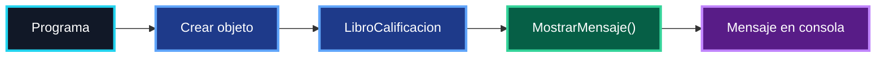

## Funcionamiento

La actividad define la clase `LibroCalificacion` y posteriormente crea una instancia de esta clase desde `Program.cs`.

El método `MostrarMensaje()` imprime un mensaje de bienvenida.

### Flujo

```text
Program.cs
    │
    ▼
new LibroCalificacion()
    │
    ▼
LibroCalificacion
    │
    ▼
MostrarMensaje()
    │
    ▼
Console.WriteLine()
    │
    ▼
Salida en pantalla
```

### Salida esperada

```text
Hello World
Bienvenido al libro de calificaciones.
```

## Captura de pantalla

<div align="center">

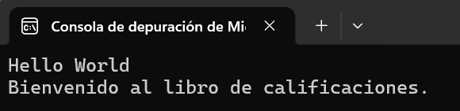

</div>

---

# 6. Actividad 2 — Método con Entrada del Usuario

## Objetivo

Solicitar información al usuario mediante la consola y utilizar ese dato como argumento de un método.

### Archivos

```text
Actividad 2 - Consola/
└── Actividad 2 - Consola/
    ├── Program.cs
    └── Class1.cs
```

## Conceptos aplicados

* Clase
* Objeto
* Método
* Parámetro
* Entrada mediante `Console.ReadLine()`
* Salida mediante `Console.WriteLine()`

## Flujo de ejecución

```mermaid
flowchart TD

    A["INICIO"] --> B["Crear objeto"]
    B --> C["LibroCalificaciones"]
    C --> D["Solicitar nombre del curso"]
    D --> E["Console.ReadLine()"]
    E --> F["Guardar nombreCurso"]
    F --> G["MostrarMensaje(nombreCurso)"]
    G --> H["Mostrar mensaje personalizado"]
    H --> I["FIN"]

    classDef start fill:#052E16,stroke:#4ADE80,color:#FFFFFF,stroke-width:3px;
    classDef process fill:#172554,stroke:#60A5FA,color:#FFFFFF,stroke-width:3px;
    classDef input fill:#713F12,stroke:#FACC15,color:#FFFFFF,stroke-width:3px;
    classDef method fill:#3B0764,stroke:#C084FC,color:#FFFFFF,stroke-width:3px;
    classDef end fill:#450A0A,stroke:#F87171,color:#FFFFFF,stroke-width:3px;

    class A start;
    class B,C process;
    class D,E,F input;
    class G,H method;
    class I end;
```

## Funcionamiento

El programa solicita al usuario el nombre de un curso.

Ese valor se almacena mediante:

```csharp
string nombreCurso = Console.ReadLine();
```

Posteriormente se envía al método:

```csharp
MostrarMensaje(nombreCurso);
```

El método utiliza el parámetro recibido para construir el mensaje mostrado en la consola.

### Flujo resumido

<div align="center">

**USUARIO**

↓

**INGRESA NOMBRE DEL CURSO**

↓

**Console.ReadLine()**

↓

**nombreCurso**

↓

**MostrarMensaje(nombreCurso)**

↓

**MENSAJE PERSONALIZADO**

</div>

## Captura de pantalla

<div align="center">

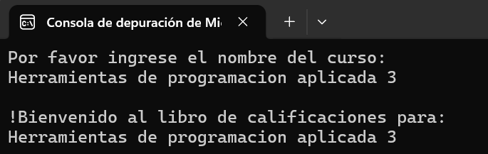

</div>

---

# 7. Actividad 3 — Constructor y Propiedad

## Objetivo

Implementar una clase más completa utilizando:

* Constructor
* Atributo privado
* Propiedad `get/set`
* Creación de múltiples objetos
* Modificación de información

### Archivos

```text
Actividad 3 - Consola/
└── Actividad 3 - Consola/
    ├── Program.cs
    └── Class1.cs
```

---

## Arquitectura de la clase

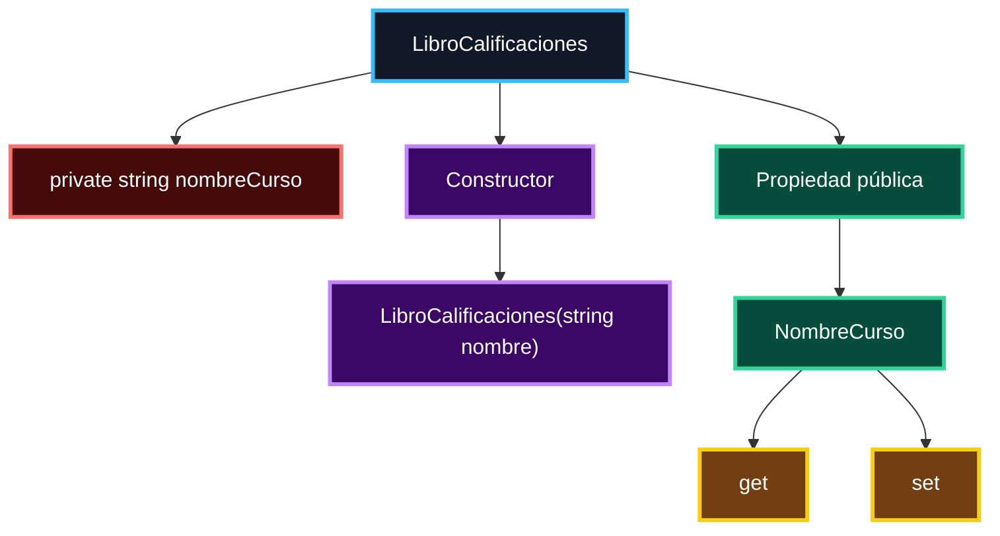

## Constructor

El constructor recibe el nombre del curso cuando se crea el objeto:

```csharp
LibroCalificaciones(string nombre)
```

Esto permite inicializar el atributo `nombreCurso` desde el momento en que se crea la instancia.

---

## Propiedad `NombreCurso`

La clase utiliza una propiedad pública:

```csharp
public string NombreCurso
{
    get { return nombreCurso; }
    set { nombreCurso = value; }
}
```

Esto permite controlar el acceso al atributo privado.

### Encapsulamiento

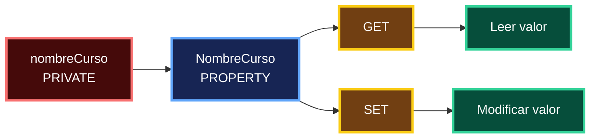

---

## Creación de objetos

El programa crea dos objetos:

```text
LibroCalificaciones
        │
        ├──────────────► Objeto 1
        │                CS101 Programacion en C#
        │
        └──────────────► Objeto 2
                         CS102 Estructura de datos
```

Posteriormente se solicita un nuevo nombre de curso y se actualiza la propiedad `NombreCurso`.

### Flujo completo

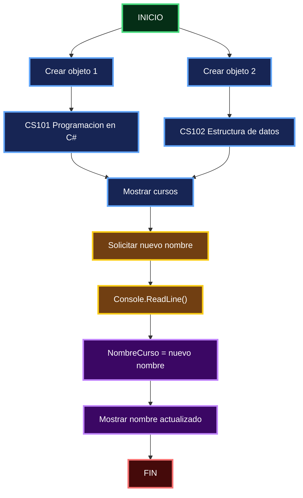

## Captura de pantalla

<div align="center">

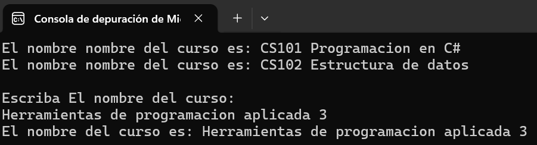

</div>

---

# 8. Comparación de las Actividades

| Característica        | Actividad 1 | Actividad 2 | Actividad 3 |
| --------------------- | :---------: | :---------: | :---------: |
| Clase                 |      ✓      |      ✓      |      ✓      |
| Objeto                |      ✓      |      ✓      |      ✓      |
| Método                |      ✓      |      ✓      |      ✓      |
| Parámetro             |      —      |      ✓      |      ✓      |
| Entrada del usuario   |      —      |      ✓      |      ✓      |
| Constructor           |      —      |      —      |      ✓      |
| Atributo privado      |      —      |      —      |      ✓      |
| Propiedad             |      —      |      —      |      ✓      |
| `get` / `set`         |      —      |      —      |      ✓      |
| Modificación de datos |      —      |      —      |      ✓      |

---

# 9. Mapa Mental del Laboratorio

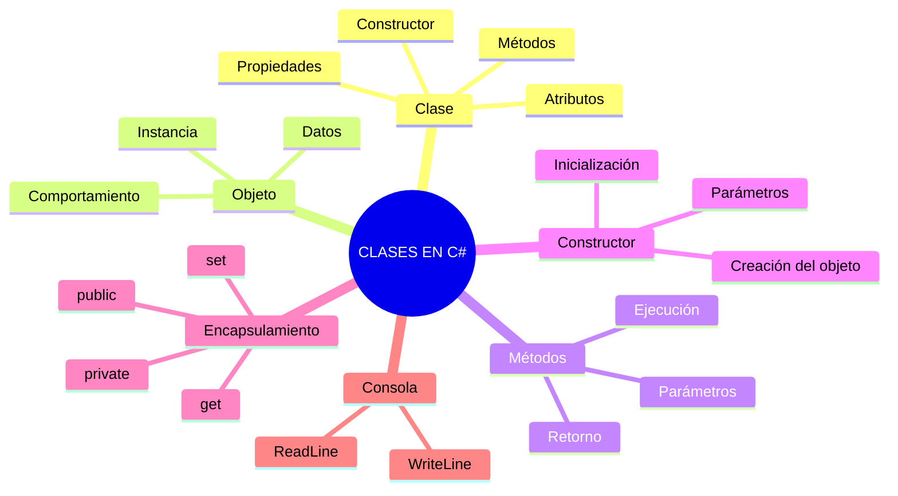

---

# 10. Evolución del Código

El laboratorio puede entenderse como una progresión de conceptos.

```mermaid
flowchart LR

    A["CLASE<br/>básica"]
    B["OBJETO<br/>instancia"]
    C["MÉTODO<br/>comportamiento"]
    D["PARÁMETRO<br/>datos"]
    E["CONSTRUCTOR<br/>inicialización"]
    F["PROPIEDAD<br/>get / set"]
    G["ENCAPSULAMIENTO"]

    A --> B --> C --> D --> E --> F --> G

    classDef c1 fill:#0F172A,stroke:#22D3EE,color:#FFFFFF,stroke-width:3px;
    classDef c2 fill:#172554,stroke:#60A5FA,color:#FFFFFF,stroke-width:3px;
    classDef c3 fill:#064E3B,stroke:#34D399,color:#FFFFFF,stroke-width:3px;
    classDef c4 fill:#713F12,stroke:#FACC15,color:#FFFFFF,stroke-width:3px;
    classDef c5 fill:#3B0764,stroke:#C084FC,color:#FFFFFF,stroke-width:3px;

    class A,B c1;
    class C,D c2;
    class E c3;
    class F c4;
    class G c5;
```

---

# 11. Capturas de Pantalla y Evidencias

Las evidencias del laboratorio están organizadas dentro de la carpeta `assets`.

<div align="center">

<table>
<tr>

<td align="center">

### Actividad 1


</td>

<td align="center">

### Actividad 2


</td>

</tr>

<tr>

<td align="center">

### Actividad 3


</td>

<td align="center">

### Progresión

**Clase → Objeto → Método → Constructor → Propiedad**

</td>

</tr>
</table>

</div>

---

# 12. Estructura del Repositorio

```text
LABORATORIO-CLASES-EN-C-SHARP-VICTOR-MONTES/
│
├── Actividad 1 -Consola/
│   └── Actividad 1 -Consola/
│       ├── Program.cs
│       ├── Class1.cs
│       └── archivo de proyecto .csproj
│
├── Actividad 2 - Consola/
│   └── Actividad 2 - Consola/
│       ├── Program.cs
│       ├── Class1.cs
│       └── archivo de proyecto .csproj
│
├── Actividad 3 - Consola/
│   └── Actividad 3 - Consola/
│       ├── Program.cs
│       ├── Class1.cs
│       └── archivo de proyecto .csproj
│
├── assets/
│   ├── banner-laboratorio-csharp.png
│   ├── actividad-1.png
│   ├── actividad-2.png
│   └── actividad-3.png
│
└── README.md
```

---

# 13. Cómo Ejecutar el Laboratorio

## Requisitos

<div align="center">

<a href="https://dotnet.microsoft.com/download">


</a>

<a href="https://visualstudio.microsoft.com/">


</a>

</div>

Se requiere:

* .NET SDK instalado.
* Visual Studio o un entorno compatible con proyectos C#.
* Git, en caso de clonar el repositorio.

## Clonar el repositorio

```bash
git clone https://github.com/VITIDEV06/LABORATORIO-CLASES-EN-C-SHARP-VICTOR-MONTES.git
```

Entrar al proyecto:

```bash
cd LABORATORIO-CLASES-EN-C-SHARP-VICTOR-MONTES
```

## Ejecutar una actividad

Entrar a la carpeta correspondiente y ejecutar:

```bash
dotnet run
```

Por ejemplo:

```bash
cd "Actividad 1 -Consola/Actividad 1 -Consola"
dotnet run
```

Para la segunda:

```bash
cd "Actividad 2 - Consola/Actividad 2 - Consola"
dotnet run
```

Para la tercera:

```bash
cd "Actividad 3 - Consola/Actividad 3 - Consola"
dotnet run
```

---

# 14. Conceptos Aprendidos

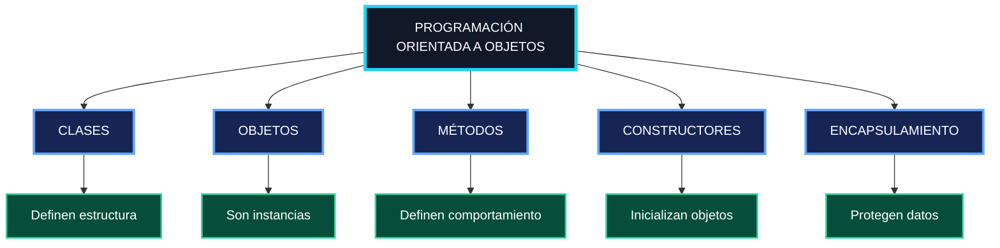

### Resumen

El laboratorio permitió trabajar de manera práctica con los fundamentos iniciales de la programación orientada a objetos en C#:

* Creación de clases.
* Creación de objetos.
* Definición y utilización de métodos.
* Uso de parámetros.
* Entrada y salida por consola.
* Creación de constructores.
* Uso de atributos privados.
* Implementación de propiedades.
* Uso de `get` y `set`.
* Modificación de información mediante propiedades.

---

# 15. Autor y Contexto Académico

<div align="center">


<br>

## Victor Montes

**Ingeniería en Sistemas y Computación**

**Universidad Tecnológica de Panamá — UTP**

**Facultad de Ingeniería de Sistemas Computacionales — FISC**

**Laboratorio #2 — Clases en C#**

**15/09/2026**

</div>

---

# 16. Referencias

## Documentación y recursos utilizados

<div align="center">

<table>
<tr>

<td align="center">

<a href="https://learn.microsoft.com/en-us/dotnet/csharp/">


</a>

</td>

<td align="center">

<a href="https://dotnet.microsoft.com/">


</a>

</td>

<td align="center">

<a href="https://visualstudio.microsoft.com/">


</a>

</td>

</tr>

<tr>

<td align="center">

<a href="https://git-scm.com/doc">


</a>

</td>

<td align="center">

<a href="https://docs.github.com/">


</a>

</td>

<td align="center">

<a href="https://www.openssl.org/">


</a>

</td>

</tr>
</table>

</div>

### Recursos

* **Video de Apoyo:** material audiovisual proporcionado para el desarrollo del laboratorio.
* **C# Documentation:** documentación oficial de Microsoft.
* **.NET Documentation:** documentación oficial de la plataforma .NET.
* **Visual Studio:** documentación y recursos oficiales del entorno de desarrollo.
* **Git Documentation:** documentación oficial de Git.
* **GitHub Documentation:** documentación oficial para gestión de repositorios.
* **Win32OpenSSL / OpenSSL:** recurso de referencia para componentes relacionados con OpenSSL.

---

# 17. Tecnologías del Proyecto

<div align="center">

<a href="https://learn.microsoft.com/en-us/dotnet/csharp/">

</a>
&nbsp;&nbsp;&nbsp;&nbsp;

<a href="https://dotnet.microsoft.com/">

</a>
&nbsp;&nbsp;&nbsp;&nbsp;

<a href="https://visualstudio.microsoft.com/">

</a>
&nbsp;&nbsp;&nbsp;&nbsp;

<a href="https://git-scm.com/">

</a>
&nbsp;&nbsp;&nbsp;&nbsp;

<a href="https://github.com/">

</a>

</div>

---

<div align="center">

### LABORATORIO #2

**CLASES EN C#**

<br>


<br><br>

**Victor Montes · Universidad Tecnológica de Panamá · 2026**

</div>
